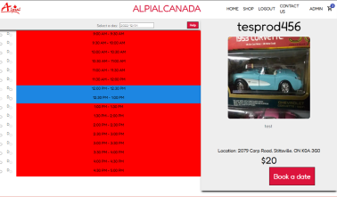

I'm formulated a bunch of projects during my undergrad at the University of Ottawa

Spreading Love Through Software
Software For Love is a non-profit organization that focuses on providing software solutions. We are a team of young professionals who are passionate about technology and seek to give back to our community.

   
This project is a finance application that has a SignUp, SignIn, BudgetPlanner, and IncomeExpenses. The BudgetPlanner has PayRate/Savings, Necessities, Wants, and Savings/Debt Repayment. The Income/Expenses has Credit Cards, Investments, Property, and Loans.

   

SpaceX, NASA, Blue Origin

Number of successful, failed, and postphoned launches as recorded in a database and displayed in a visual PI graph

   
This project is being completed as part of the SEG2105 course. The project is a app that streamlines the walk-in clinic experience. Some features include allowing users to search for clinics based off location, wait times, and services provided.

   
Alpialcanada is an e-commerce website created for the SEG4910/SEG4911 project used to showcase the merchandise application where there is a shop, contact us, admin, and logout/login page.

  
Journaspect is an jouranlism application used to hold jouranlists accountable, as well as, my profile page to set a profile, sign in, sign up, a search bar feature to search journalists, adding journalists, and removing journalists.